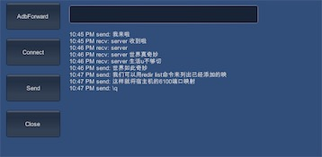

## USB 连接测试

pc通过usb连接Android手机， 然后通过adb forward建立端口转发。

测试使用的转发端口是30000， 35000， 测试前请避免被其他进程占用。

## 流程

* USB连接到pc， 确保开启调试模式
* Unity导出apk, 在Android手机上安装， 运行起来点击Listening, 开始监听
* 修改ADBExecutor的adb真实的安装路径
* Editor运行起来， 点击Adbforward, 建立端口转发
* Editor 点击Connect，建立长链接
* 之后点击Send就可以互发消息了。

## 效果

