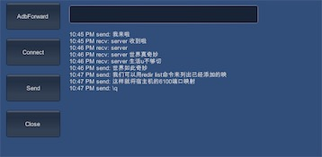
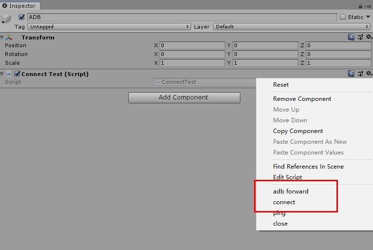
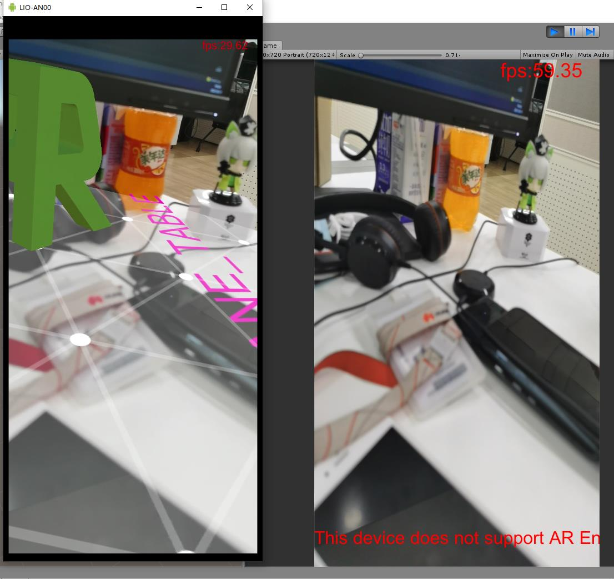
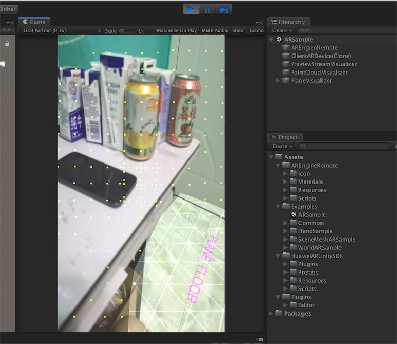
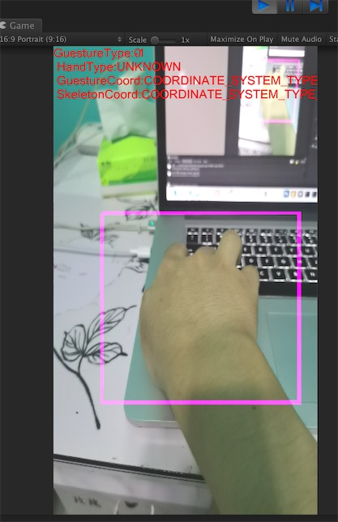

# AR Engine Remote

pc通过usb连接Android手机， 然后通过adb forward建立端口转发。基于此，用来在pc上动态调试AR中间内容， 从而避免大量出包占用时间在手机上测试。

### 注意：

测试使用的转发端口是35001， 35002， 测试前请避免被其他进程占用。

如果被占用或者连接不上手机， 可以直接通过在终端上输入命令：

```
adb forward tcp:35002 tcp:35001
```


# 效果1


### 流程

* USB连接到pc， 确保开启调试模式
* Unity导出apk, 在Android手机上安装， 运行起来点击Listening, 开始监听
* Editor运行起来， 点击Adbforward, 建立端口转发
* Editor 点击Connect，建立长链接
* 之后点击Send就可以互发消息了。

切换到 master 分支， 可以联调：




# 效果2

预览流推送，切换到 arengine 分支， 可以看到效果


### 流程

* USB连接到pc， 确保开启调试模式
* Unity导出apk, 在Android手机上安装， 运行起来点击Listening, 开始监听
* Editor运行起来， ConnectTest点击齿轮按钮， 分别 connect 建立连接之后就可以看到预览流了





### 特性

目前之前的AR Engine里的特性如下：

1. 预览流推送



2. 点云的绘制


3. 平面检测


4. 场景Mesh生成


5. 手势识别


6. 人脸识别


